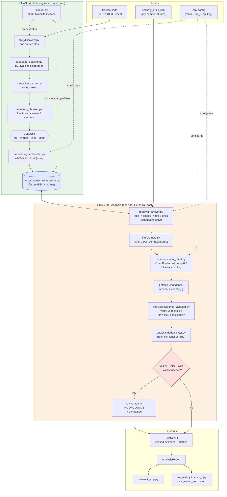
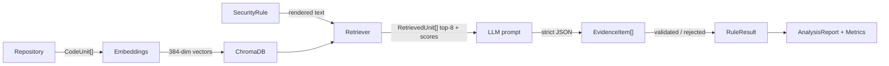

# Architecture — Verified RAG Security Analyzer

## Printable One-Page Diagram

```
================================================================================
                        VERIFIED RAG SECURITY ANALYZER
================================================================================

  INPUTS                              OUTPUTS
  --------                            --------
  Source code (any size)              Verified vulnerability report
  security_rules.json (any count)     + per-rule metrics
  .env (model, top_k, keys)           + token & runtime accounting

================================================================================
PHASE A — INDEXING            (runs ONCE per repo · local · free · no LLM)
================================================================================

   REPOSITORY
       |
       v
  [file_discovery.py]     walk folder, keep source files (< 1 MB)
       |
       v
  [language_detector.py]  extension -> language (py, java, js, ts, c, cpp, go, rs)
       |
       v
  [tree_sitter_parser.py] parse real syntax trees (grammar-aware)
       |
       v
  [semantic_chunker.py]   cut into CodeUnits: whole functions / classes / methods
       |                  (fallback: whole file = one "module" unit)
       v
   CodeUnit { file, language, symbol, type, start_line, end_line, code, id }
       |
       v
  [embeddings/embedder.py]      all-MiniLM-L6-v2 (LOCAL) -> 384-dim vectors
       |
       v
  [vector_store/chroma_store.py]  ChromaDB on disk (.chroma/) : vector + metadata
       |
       v
  [indexer.py]   orchestrates all of the above
                 + sha256 manifest cache: unchanged files are skipped on re-run

================================================================================
PHASE B — ANALYSIS            (per security rule · exactly 1 LLM call per rule)
================================================================================

   security_rules.json  -->  for EACH rule (no hardcoded count):
       |
       v
  [retrieval/retriever.py]   rule text -> embed -> ChromaDB top-k (=8)
       |                     CANDIDATE GENERATION ONLY - similarity != guilt
       v
   RetrievedUnit x 8 (code + similarity score)
       |
       v
  [llm/prompts.py]           SYSTEM_PROMPT contract:
       |                     "analyze ONLY supplied code; never invent files/
       |                      lines/code; cite exact evidence; strict JSON only"
       v
  [llm/openrouter_client.py] ONE chat call (model from .env, temperature 0.0)
       |                     timeout + retries + token accounting
       v
   Strict JSON: { status, confidence, reason, evidence[] }
       |
       v
  [analysis/analyzer.py]     parse JSON (fail -> INCONCLUSIVE, keep raw)
       |                     whitelist status, clamp confidence 0..1
       v
  [analysis/evidence_validator.py]   EVERY evidence item vs REAL DISK:
       |                     1) file exists?  (rel / suffix / basename match)
       |                     2) line number in range?
       |                     3) cited code literally in file? (ws-normalized)
       |                     -> valid "verified against repository"
       |                     -> rejected + specific reason
       v
  [analysis/deduplicator.py] dedupe findings by (rule_id, file, function, line)
       |
       v
  [analyzer.py FINAL GATE]   VULNERABLE with ZERO valid evidence
       |                     => downgraded to INCONCLUSIVE (+ annotation)
       v
   RuleResult { status, confidence, reason, verified evidence, metrics }
       |
       v
   AnalysisReport --------------->  streamlit_app.py  (interactive UI)
                     |              live_test.py      (scored vs ground_truth)
                     +-------------> bench_*.py       (retrieval/perf benchmarks)

================================================================================
SHARED FOUNDATIONS
================================================================================
  models/schemas.py   CodeUnit | SecurityRule | RetrievedUnit | EvidenceItem |
                      RuleResult | AnalysisMetrics   (one language, all modules)
  config.py           everything from .env - no hardcoded models, keys, or rules

================================================================================
GUARANTEES
================================================================================
  Scales to 100K+ lines   LLM sees only top-k units per rule (flat prompt size)

## Mermaid Diagram (renders on GitHub / VS Code / mermaid.live)



## Data Contracts (what flows between modules)



  Flat cost               N rules = N LLM calls, regardless of repo size
  No hallucinated proof   every cited file/line/snippet verified on disk
  No fake VULNERABLE      unverifiable verdicts auto-downgrade to INCONCLUSIVE
  Language-agnostic       8 languages -> one CodeUnit shape
  Deterministic           temperature 0.0, fixed top_k, 26 offline tests
  Cache-friendly          sha256 manifest skips unchanged files on re-index
================================================================================
```
